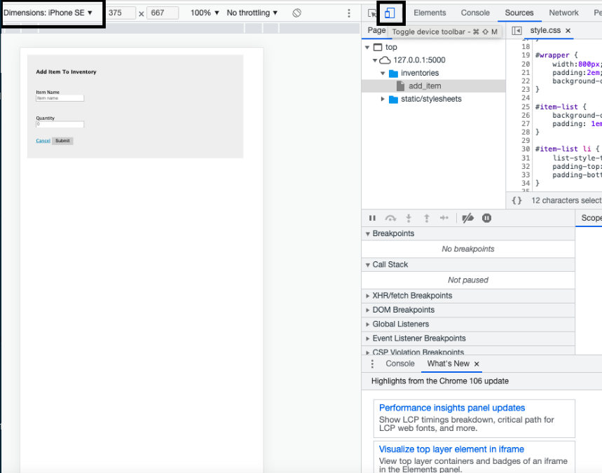

[](https://classroom.github.com/online_ide?assignment_repo_id=8874496&assignment_repo_type=AssignmentRepo)
# Web Application Exercise

A little exercise to build a web application following an agile development process. See the [instructions](instructions.md) for more detail.

## Product vision statement

Inventory Check is a web application for store owners to keep track of the stock they have. With this web application, they will be able to add new items, edit inventory, delete items, and make sure everything is updated consistently.

## User stories

[Link](https://github.com/software-students-fall2022/web-app-exercise-team-10-1/issues) to our user stories.

## Task boards

[Link](https://github.com/software-students-fall2022/web-app-exercise-team-10-1/projects?query=is%3Aopen) to our taskboards.

## Team Members
- Hillary Davis
- Michelle Lu
- Misha Seo
- Jenny Shen

## Instructions to run our app
### Build and launch the database

- install and run [docker desktop](https://www.docker.com/get-started)
- create a [dockerhub](https://hub.docker.com/signup) account
- run command, `docker run --name mongodb_dockerhub -p 27017:27017 -e MONGO_INITDB_ROOT_USERNAME=admin -e MONGO_INITDB_ROOT_PASSWORD=secret -d mongo:latest`

The back-end code will integrate with this database. However, it may be occasionally useful interact with the database directly from the command line:

- connect to the database server from the command line: `docker exec -ti mongodb_dockerhub mongosh -u admin -p secret`
- show the available databases: `show dbs`
- select the database used by this app: `use example`
- show the documents stored in the `messages` collection: `db.messages.find()` - this will be empty at first, but will later be populated by the app.
- exit the database shell whenever you have had your fill: `exit`

### Create a `.env` file
* The .env file can be found in our Discord channel under the thread "Required files".

### Set up a Python virtual environment

This command creates a new virtual environment with the name `.venv`:

```bash
python3 -m venv .venv
```

### Activate the virtual environment

To activate the virtual environment named `.venv`...

On Mac:

```bash
source .venv/bin/activate
```

On Windows:

```bash
.venv\Scripts\activate.bat
```
### Install dependencies into the virtual environment

The file named, `requirements.txt` contains a list of dependencies - other Python modules that this app depends upon to run.  
Run this command

```bash
pip3 install -r requirements.txt
```

### Run the app

- Define two environment variables from the command line:
  - on Mac, use the commands: `export FLASK_APP=app.py` and `export FLASK_ENV=development`.
  - on Windows, use `set FLASK_APP=app.py` and `set FLASK_ENV=development`.
- start flask with `flask run` - this will output an address at which the app is running locally, e.g. https://127.0.0.1:5000. Visit that address in a web browser.

### See the app in the correct format
- Open developer tools
- Click on the icon to the left of the Elements tab

- Set the dimensions to 375 x 667 (standard iPhone SE size)
